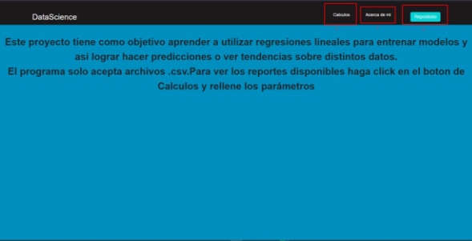
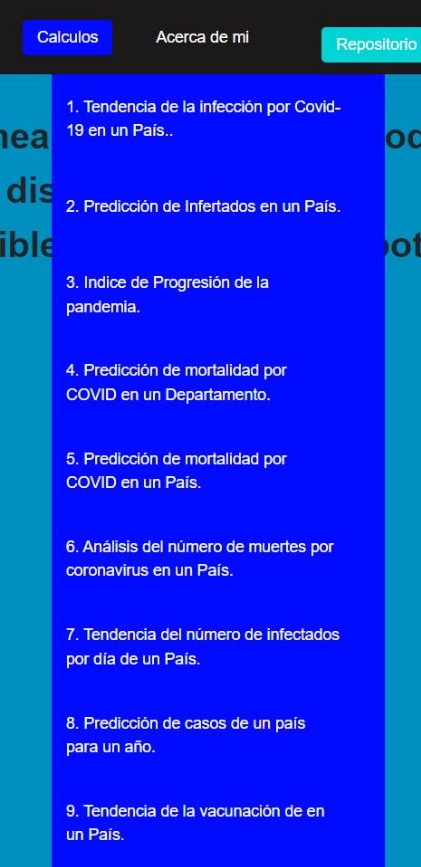
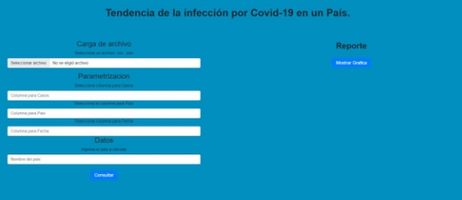
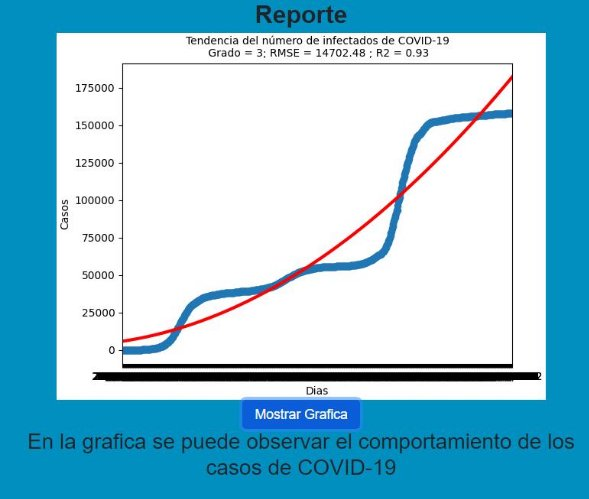

#Manual De Usuario La interfaz principal del programa tiene 3 opciones  

1. Cálculos: Esta pestaña contiene todos los cálculos que el programa puede realizar 

2. Acerca de mí: redirige a una página que contiene información del programador 
2. Repositorio: Redirige al repositorio de GitHub donde está el código fuente de la aplicación 

Se requiere que se llenen algunos campos para poder realizar el cálculo 

Carga de archivo: En esta parte se debe seleccionar un archivo de extensión csv 

Parametrización: En esta parte debemos indicar el nombre de las columnas que vamos a utilizar 

Datos: En esta parte debemos indicar los datos que vamos a calcular posteriormente presionar en el botón consultar 

Reporte: En esta parte aparecerá la respuesta del cálculo, mostrando una gráfica y una pequeña descripción de la misma 

