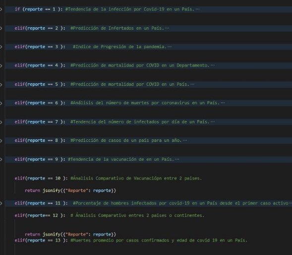
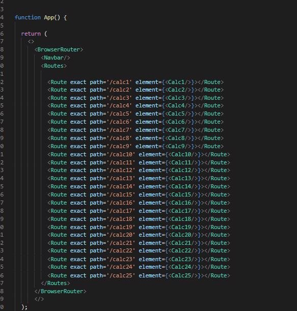

# Manual Tecnico

Para el proyecto de Coronavirus Data Analysis with Machine Learnign, se utilizaron las siguientes herramientas 

\-  Python 3.8y flask : Se utilizó esta combinación para el backend de la aplicación 

**Scikit learn:** para hacer todos los cálculos de Machine Learning, se instaló  con el siguiente comando **pip install -U scikit-learn** 

**Matplotlib:** Esta librería se utilizó para hacer las gráficas con los datos obtenidos en scikit learn, se instaló con el siguiente comando **pip install matplotlib** 

**React Js:** Este framework se utilizó para el front-end de la aplicación. 

**Heroku:** Se utilizó para hacer el deploy de la aplicación en un servidor 

Se importaron todas estas liberías para poder hacer todos los cálculos de la aplicación 

Se crearon dos rutas /plot ,/reportes la ruta /plot con método get se utiliza para mandar a llamar a la gráfica y la ruta /reportes con método post es la que se encarga de hacer todos los cálculos dependiendo del reporte 

Del lado del frontend se manda el número del reporte para que el programa sepa cual reporte es el que va a realizar  

En nuestro front-end utilizamos la herramienta Routes de Reactjs que nos permite movernos entre rutas en la aplicación, cada reporte tiene su componente creado 

En cada elemento utilizamos la herramienta useState que nos permite cambiar el estado de algún elemento de la página sin tener que actualizarla 

Utilizamos una función async para que nuestra petición nos devuelva la imagen como objeto, al tener la respuesta utilizamos .blob para acceder al contenido 

Con handleClick hacemos nuestra petición post y mandamos los datos que parametrizamos en el front así el backend tiene los datos para trabajar 

Utilizamos otra función async para enviar el contenido del archivo .csv que se subió, leemos el contenido y seteamos esa variable con el usestate para luego enviarlo en nuestra petición post 

